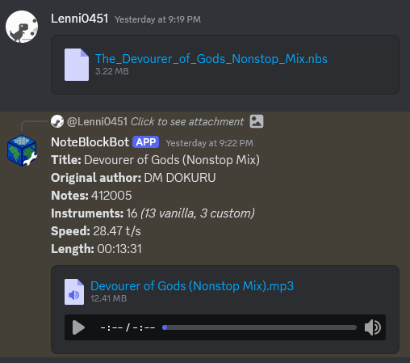

# NoteBlockBot
A Discord bot capable of rendering and modifying nbs files.

## Features

Converting sent nbs files to mp3 for easier listening

Converting midi to nbs

\
(Yes, it really only takes one second)

## Setup
There are no prebuilt binaries available. You have to build the project yourself.

1. Make sure you have Java 17 or higher installed
2. Clone the repository
3. Open a terminal in the project directory
4. Run `./gradlew build`
5. Take the generated jar from `build/libs/NoteBlockBot-<version>.jar`

When you run the bot for the first time, it will generate a `token.txt` file. You have to put your bot token in there (create a bot [here](https://discord.com/developers/applications/)).\
After that, you can start the bot and it will generate a `config.yml` file. You can configure rate limits there. The default values are fine for most users. If you only want to use the bot privately, you can turn them up to whatever you want.

## Admin commands
When the bot is on a server, you can use the `/setup` command to configure the bot.\
Currently there is only one setting: The channel where the bot will announce new uploads.\
More might be added in the future.

## Public commands
The `/midiconverter` command can be used by anyone to convert midi files to nbs.

## Public instance
Due to the bot being heavy on resources when uploading large/many files, I can't host it freely accessible.\
If your server is significant/small enough, I might consider hosting it for you. You can ask me in the issues tab.
